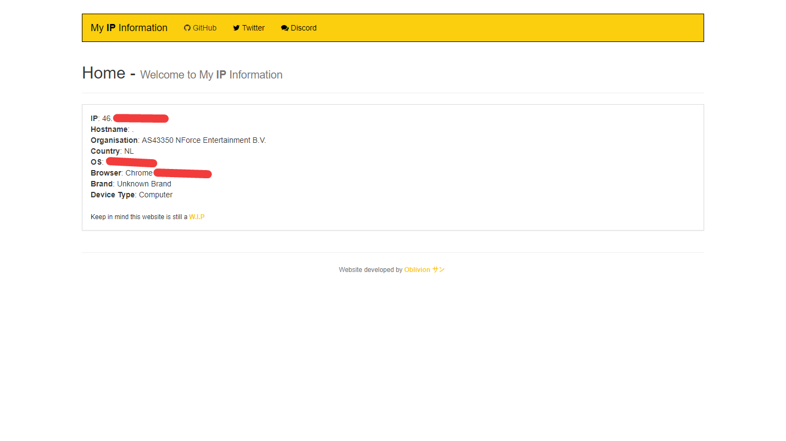

# my-ip-information
[](https://github.com/OblivionSan/discord-bot-example/blob/master/LICENSE)
[](https://github.com/OblivionSan/discord-bot-example/stargazers)
[](https://github.com/OblivionSan/discord-bot-example/network)
[](https://github.com/OblivionSan/discord-bot-example/issues)

> A simple my-ip-information page, nice and easy to read.

## Getting started

```
$ git clone https://github.com/OblivionSan/my-ip-information.git
```


Edit whatever you want to change, don't ask me to do it.



## Built with
> [HTML](http://devdocs.io/html/)

> [CSS](http://devdocs.io/css/)

> [PHP](http://devdocs.io/php/)

## Author
- **OblivionSan** - [@OblivionSan](https://twitter.com/OblivionSan) | [Discord Server](https://discord.gg/kxNeGRC) | [Website](https://oblivionsan.tk)